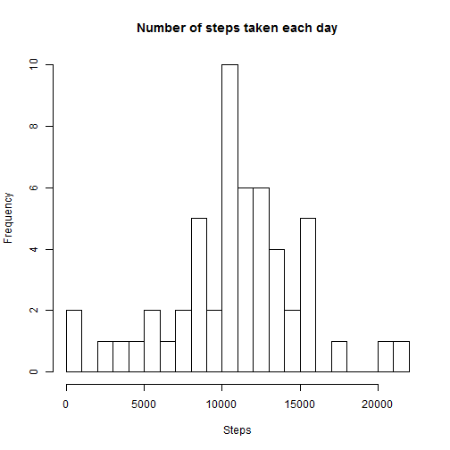
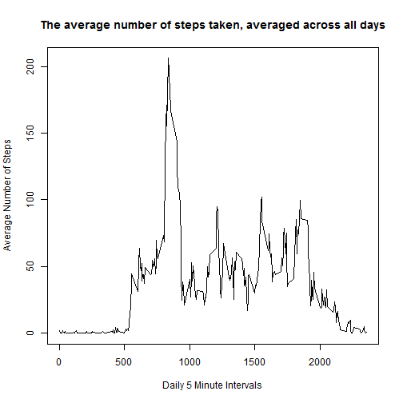
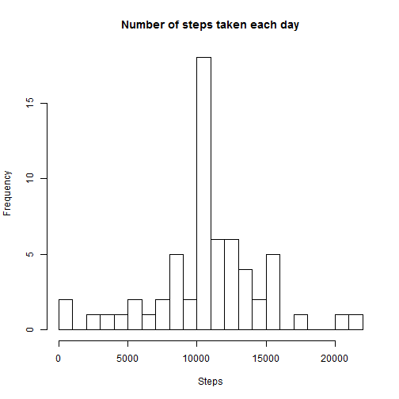

- Coursera - Data Science
- Reproducible Research: Peer Assessment 1
- Mike Stillman
- 10/13/2014

## Loading and preprocessing the data
This analysis will involve loading and preprocessing an activity monitoring dataset collected from an anonymous individual during the months of October and November, 2012 and includes the number of steps taken in 5 minute intervals each day. The code below was used for the dataset.
The filename is activity.csv and can be aquired by forking this Github repository:  http://github.com/rdpeng/RepData_PeerAssessment1


```r
#Set working directory
dir<-"C:/DataScience/Coursera/ReproducibleResearch/Assignment1/RepData_PeerAssessment1/activity"
setwd(dir)

#Import activity csv file
dt<-read.csv("activity.csv", header = TRUE)

#Convert date column to a date datatype for future use
dt$date<-as.Date(dt$date, format = "%Y-%m-%d")
```


## What is mean total number of steps taken per day?

```r
#Make a histogram of the total number of steps taken each day
dtAgg <- aggregate( steps ~ date, data = dt, sum)
hist(dtAgg$steps,breaks=20,main="Number of steps taken each day",xlab="Steps")
```

 

```r
#Calculate and report the mean and median total number of steps taken per day
Mean<-as.integer(mean(dtAgg$steps))
Median<-as.integer(median(dtAgg$steps))
```

The mean total number of steps taken per day is 10766.
The median total number of steps taken per day is 10765.


## What is the average daily activity pattern?

```r
#Make a time series plot (i.e. type = "l") of the 5-minute interval (x-axis) and the average number of steps taken, averaged across all days (y-axis)
dtAggInterval <- aggregate( steps ~ interval, data = dt, mean)


plot(dtAggInterval$interval, dtAggInterval$steps, type="l", xlab="Daily 5 Minute Intervals", ylab="Average Number of Steps", main = "The average number of steps taken, averaged across all days")
```

 

```r
#Which 5-minute interval, on average across all the days in the dataset, contains the maximum number of steps?
MaxSteps<-subset(dtAggInterval, steps == max(dtAggInterval$steps))
```
The daily interval with the highest average number of steps is interval 835, with an average of 206.1698 steps.


## Imputing missing values

```r
#Calculate and report the total number of missing values in the dataset (i.e. the total number of rows with NAs)
dt$na<-is.na(dt$steps)
dtMissing<-subset(dt, na == "TRUE")
Count<-nrow(dtMissing)
```
The number of rows in the dataset with NA is 2304.


```r
#Devise a strategy for filling in all of the missing values in the dataset. The strategy does not need to be sophisticated. For example, you could use the mean/median for that day, or the mean for that 5-minute interval, etc.

#The strategy use is to capture the average steps per daily interval for the non NA records and then update the NA records for those intervals with the mean.


#Create dataset with just complete records
dtComplete<-subset(dt, na == "FALSE")

#Find the average per daily interval, excluding the NA records.
dtCompleteMean <- aggregate( steps ~ interval, data = dtComplete, mean)

#Update the dtMissing data set with the dtCompleteMean dataset in order to set the mean per interval as a substitute for the NA values.
dtMissingMean<-merge(x = dtMissing, y = dtCompleteMean, by = "interval", all.x=TRUE)
```


```r
#Create a new dataset that is equal to the original dataset but with the missing data filled in.

#Row bind the Complete and newly updated Missing dataset.
dtComplete1<-subset(dtComplete, select = -c(na))
dtMissingMean$steps<-dtMissingMean$steps.y
dtMissing1<-subset(dtMissingMean, select = -c(steps.x, steps.y, na))

dtAll<-rbind(dtComplete1,dtMissing1)
```


```r
#Make a histogram of the total number of steps taken each day and Calculate and report the mean and median total number of steps taken per day. Do these values differ from the estimates from the first part of the assignment? What is the impact of imputing missing data on the estimates of the total daily number of steps?

dtNoNAAgg <- aggregate( steps ~ date, data = dtAll, sum)
hist(dtNoNAAgg$steps,breaks=20,main="Number of steps taken each day",xlab="Steps")
```

 

```r
#Calculate and report the mean and median total number of steps taken per day
Mean<-as.integer(mean(dtNoNAAgg$steps))
Median<-as.integer(median(dtNoNAAgg$steps))
```

Upon removing NA value from the dataset and replacing them with the average steps for the respective interval for complete records...
The mean total number of steps taken per day is 10766.
The median total number of steps taken per day is 10766.

The value are basically the same as the first part of the assignment, which the exception that the frequency of values close to the mean has increased.


## Are there differences in activity patterns between weekdays and weekends?


```r
#Create a new factor variable in the dataset with two levels - "weekday" and "weekend" indicating whether a given date is a weekday or weekend day.
dtAll$day <- sapply(weekdays(dtAll$date), switch, 
                  Sunday = 'weekend', 
                  Monday = 'weekday', 
                  Tuesday = 'weekday', 
                  Wednesday = 'weekday',
                  Thursday = 'weekday',
                  Friday = 'weekday',
                  Saturday = 'weekend')
```
   

```r
#Make a panel plot containing a time series plot (i.e. type = "l") of the 5-minute interval (x-axis) and the average number of steps taken, averaged across all weekday days or weekend days (y-axis). The plot should look something like the following, which was creating using simulated data:
dtAllAgg <- aggregate(steps ~ interval+day, data = dtAll, mean)
library(lattice)
xyplot(steps ~ interval | day, data = dtAllAgg, type = "l", layout = c(1, 2))
```

 
